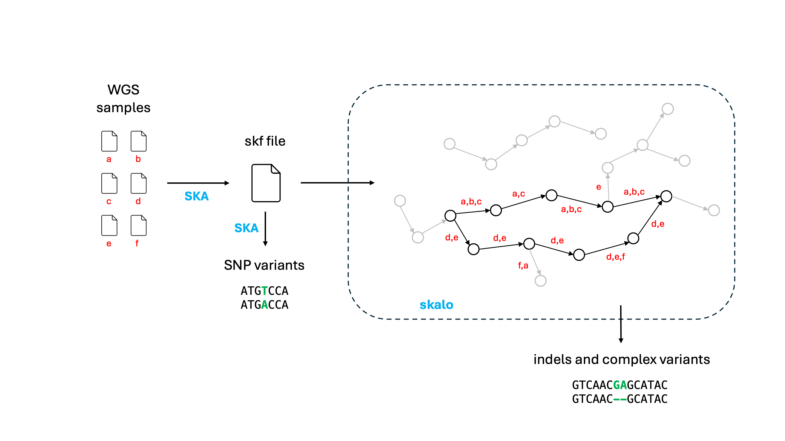

[](https://github.com/rderelle/skalo/releases)

<h1 align="center">skalo</h1>


### Overview

skalo is a graph-based algorithm designed to infer indels and complex variants from WGS outbreak data. skalo uses the multi-samples split k-mer files generated by SKA as input, so inherits the computational efficiency of the SKA algorithm which generates these. It converts non-ubiquitous split k-mers (i.e., absent in at least one sample) into a local colored de Bruijn graph, as introduced by cortex (Iqbal et al. 2012), and leverages the sample distributions of k-mers to traverse the graph and identify variants.




### Installation
you can download this repository and, once inside the downloaded directory, compile skalo with cargo:
```
cargo build --release
```
skalo will be located in the directory target/release/.

### Running skalo
The default command line is:
```
skalo -i example.skf
```
Using this split-kmer file, skalo infers 104 indels and complex variants.


### Output files
skalo output consists of 3 files:
+ a FASTA file containing the unaligned sequences of variant groups
+ a binary alignment in FASTA format representing the distribution of minor and major variants among samples
+ a TSV file describing all variants (similar to VCF files obtained from read-alignment)

The 'pos_ali' field of the TSV file corresponds to the position of the variant in the binary alignment (0-based position). This ID number is also used to characterise variant groups in the fasta file containing the unaligned sequences (name of sequences). This common nomenclature between files should facilitate post-analyses of indels.

In the cases of more than 2 variants inferred for a given variant group, the binary alignment only contains the distribution of the 2 variants detected in the highest number of samples, (i.e., the 2 most informative variants; other variant(s) represented as missing data).


